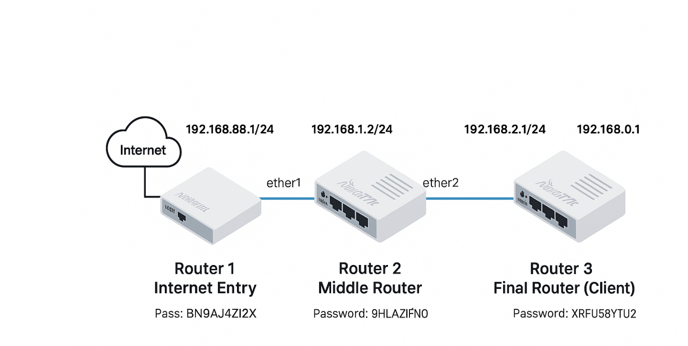
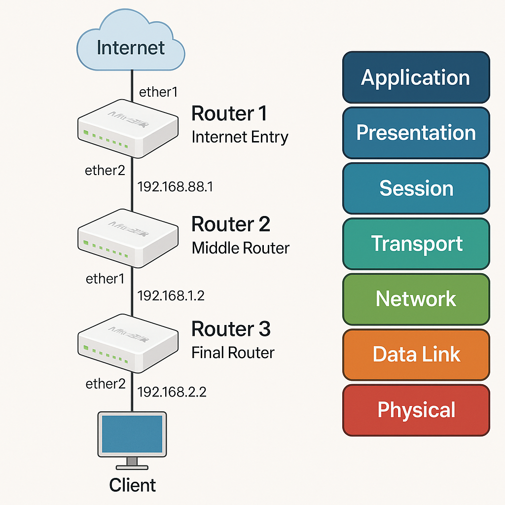

# task-3-Microtic-Routers-RIP


# MikroTik RIP Routing Configuration Guide

This guide covers the configuration of three MikroTik routers using both **SSH (Terminal)** and **Winbox GUI**, with **RIP v2 routing protocol** for dynamic routing between routers.






---

## 🖧 Network Topology


       INTERNET
           │
    [ether1: DHCP]
     Router 1 (R1)
     192.168.88.1/24
     192.168.1.1/24
                  │
        ┌─────────┘
        ▼
       Router 2 (R2)
       192.168.1.2/24
       192.168.2.1/24
       │
       ▼
       Router 3 (R3)
       192.168.2.2/24
       DNS: 8.8.8.8


---

## ⚙️ Router 1 - Gateway Router

### Terminal (SSH)
```bash
ip address add address=192.168.88.1/24 interface=ether1
ip address add address=192.168.1.1/24 interface=ether2
ip dhcp-client add interface=ether1 use-peer-dns=yes use-peer-ntp=yes
ip firewall nat add chain=srcnat out-interface=ether1 action=masquerade
routing rip interface add interface=ether2 receive=v2 send=v2
routing rip network add network=192.168.1.0/24
Winbox GUI
IP > Addresses:

192.168.88.1/24 on ether1

192.168.1.1/24 on ether2

IP > DHCP Client:

Interface: ether1, Peer DNS ✅, Peer NTP ✅

IP > Firewall > NAT:

Chain: srcnat, Out Interface: ether1, Action: masquerade

Routing > RIP > Interface: ether2

Routing > RIP > Networks: 192.168.1.0/24

🔁 Router 2 - Middle Router
Terminal (SSH)

ip address add address=192.168.1.2/24 interface=ether1
ip address add address=192.168.2.1/24 interface=ether2
routing rip interface add interface=ether1 receive=v2 send=v2
routing rip interface add interface=ether2 receive=v2 send=v2
routing rip network add network=192.168.1.0/24
routing rip network add network=192.168.2.0/24
Winbox GUI
IP > Addresses:

192.168.1.2/24 on ether1

192.168.2.1/24 on ether2

Routing > RIP > Interface: ether1, ether2

Routing > RIP > Networks: 192.168.1.0/24, 192.168.2.0/24

🧑‍💻 Router 3 - Client Router
Terminal (SSH)

ip address add address=192.168.2.2/24 interface=ether1
ip dns set servers=8.8.8.8 allow-remote-requests=yes
routing rip interface add interface=ether1 receive=v2 send=v2
routing rip network add network=192.168.2.0/24
Winbox GUI
IP > Addresses: 192.168.2.2/24 on ether1

IP > DNS: 8.8.8.8, enable ✅ "Allow Remote Requests"

Routing > RIP > Interface: ether1

Routing > RIP > Networks: 192.168.2.0/24

🧪 Connectivity Test (from Router 3)

ping 8.8.8.8
ping google.com

+++++++++++++++++++++++++++++++++++++++++++++++++++++++++++++++++++++++++++++++++++++++++++++++++++++

MikroTik 3-Router Lab in GNS3 with CHR, RoMON, Static & RIP

1. Overview

This guide explains how to create a MikroTik 3-router lab using GNS3 with CHR images. You will
configure static routing, RIP protocol, NAT, and RoMON for Winbox management.

2. Network Diagram

3. Lab Setup Steps

1. Install GNS3, VirtualBox or QEMU, and Winbox.
2. Download MikroTik CHR image (.img) from https://mikrotik.com/download.
3. Add CHR to GNS3 as QEMU VM with 256MB RAM and 3 interfaces.
4. Create 3 routers: CHR-A, CHR-B, CHR-C and connect them in series.
5. Add a cloud node connected to CHR-A for Winbox access from your PC.


4. Enabling RoMON
/tool romon set enabled=yes
/tool romon set id=routerA (optional)Then use Winbox > Tools > RoMON to connect to other routers via CHR-A.


5. IP Configuration
Router A:
/ip address add address=192.168.1.1/24 interface=ether2
/ip firewall nat add chain=srcnat out-interface=ether1 action=masquerade
Router B:
/ip address add address=192.168.1.2/24 interface=ether1
/ip address add address=192.168.2.1/24 interface=ether2
Router C:
/ip address add address=192.168.2.2/24 interface=ether1


6. Static Routing
Router B:
/ip route add dst-address=0.0.0.0/0 gateway=192.168.1.1
Router C:
/ip route add dst-address=0.0.0.0/0 gateway=192.168.2.1


7. RIP Protocol Setup
Router A:
/routing rip interface add interface=ether2
/routing rip network add network=192.168.1.0/24
Router B:
/routing rip interface add interface=ether1
/routing rip interface add interface=ether2
/routing rip network add network=192.168.1.0/24/routing rip network add network=192.168.2.0/24
Router C:
/routing rip interface add interface=ether1
/routing rip network add network=192.168.2.0/24


8. Connectivity Testing
From Router C:
/tool ping 192.168.2.1
/tool ping 192.168.1.1
/tool ping 8.8.8.8
